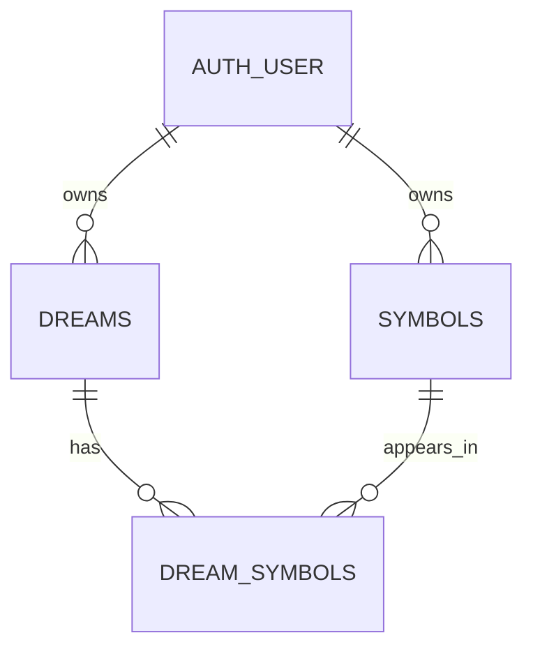

# Database design and tooling

Steps 5 and 6 define the connection and schema in code. They do not create tables
in Neon or replace the shared mock records used by the app.

## Files and dependencies

| File | Responsibility |
| --- | --- |
| `lib/db/index.ts` | Server-only Drizzle client backed by a small `pg` connection pool |
| `lib/db/env.ts` | Validate the database URL without logging its contents |
| `lib/db/schema.ts` | Application tables, constraints, indexes, relations, and inferred row types |
| `lib/db/auth-schema.ts` | Reference the existing Neon-managed user ID; not a migration target |
| `drizzle.config.ts` | Load Next.js environment files and configure schema generation |
| `scripts/check-db.ts` | Read-only connection and auth ID type check |
| `lib/db/schema.test.ts` | Test generated schema in isolated, in-memory PostgreSQL |

`drizzle-orm` provides typed queries; `pg` connects to PostgreSQL from the Next.js
Node runtime and supports interactive transactions. Use Neon's pooled connection
URL for deployed request handling. Do not use this client in the browser or an Edge
runtime. The pool is reused across development reloads and opens connections lazily.
Its five-connection limit is per process, not a global limit across hosting instances.

`drizzle-kit` is the schema/migration tool. `@next/env` makes it load `.env.local`
the same way Next.js does. `@types/pg` provides driver types; `tsx` runs TypeScript
checks; PGlite runs PostgreSQL locally in memory for constraint tests.

## Tables



- **dreams:** generated UUID ID, owner UUID, title, plot, dream date, mood, timestamps.
- **symbols:** generated UUID ID, owner UUID, name, emoji, timestamps.
- **dream_symbols:** owner UUID, dream UUID, symbol UUID. One row per attachment.

The owner references `neon_auth.user.id`. Its UUID type was checked against the
configured database's column metadata. Neon manages users/passwords/sessions;
Drizzle's schema entry point includes only our three application tables. The tests
also verify that generated DDL does not attempt to create the auth table.

Dream dates use PostgreSQL `date` and map to `YYYY-MM-DD` strings, avoiding timezone
shifts. Creation/update timestamps use `timestamptz`. `updated_at` is set on insert
and updated by Drizzle's `$onUpdate`; it is not a database trigger. Any future raw
SQL updates must set it explicitly.

Moods use the six existing `Mood` values. A future change to that enum requires a
migration. Plot length is capped at 3000 PostgreSQL characters, symbol names at 80,
and emoji at 32 (to accommodate multi-codepoint emoji). Application validation still
runs before writes; JavaScript string length and PostgreSQL character length can
differ for emoji. Blank values made only of spaces are rejected by database checks.

## Ownership and integrity rules

Each dream and symbol must reference an existing auth user. Symbol names are unique
per owner using `lower(btrim(name))`: Alice and Bob can each have Moon, but Alice
cannot have both Moon and ` moon `. Application writes should still trim names.
PostgreSQL case conversion uses the database locale; this is not fuzzy matching or
full Unicode normalization.

The linking table has two **composite foreign keys**:

```text
(user_id, dream_id)  -> dreams(user_id, id)
(user_id, symbol_id) -> symbols(user_id, id)
```

For an Alice-owned dream linked to Bob's symbol, no choice of `user_id` can satisfy
both references. PostgreSQL rejects that link, including attempts made by updates.
The composite primary key prevents attaching the same symbol to a dream twice.

Deleting a dream removes its links but preserves symbols. Deleting a symbol removes
its links but preserves dreams. Deleting a Neon auth user cascades to that user's
dreams, symbols, and links. This is physical deletion, not a trash/archive feature.

Indexes support owner/date archive queries and looking up an owner's dreams by
symbol. Counts and co-occurrence remain query results, not separately stored totals.
Manual symbol associations are deferred until that feature is implemented.

## Authorization still belongs in the data-access layer

Foreign keys enforce valid relationships; they do not decide who may read a row.
This connection does not automatically inherit the current Neon Auth session, and
this step does not enable PostgreSQL row-level security.

When replacing mocks, every operation must get the user from `requireUser()` and
filter by that ID. Never accept the owner from form input. Reading/updating/deleting
one dream must match both `dreams.id` and `dreams.userId`; the same rule applies to
symbols. Validate symbol ownership and save a dream plus its links in one transaction.
Keep direct database access in server-only data-access modules. Do not expose these
tables through a browser Data API without adding and testing RLS policies.

`DreamRecord` and `SymbolRecord` describe database rows. Existing UI types remain
unchanged for now; the data-access layer will map rows and symbol links into them.

## Commands and next step

```sh
npm run db:check
npm run test:db
```

`db:check` reads only auth column metadata. `test:db` uses an in-memory database and
fake users, never the Neon connection or real accounts. It checks cross-user links,
duplicates, missing owners, validation constraints, and deletion behavior.

For step 7, `npm run db:generate` generates versioned SQL migration files locally;
it does not apply them. Review those files before applying them to the development
branch. Generation and application of the initial migration are intentionally left
for that step. No `db:push` command is provided to bypass migration review.
